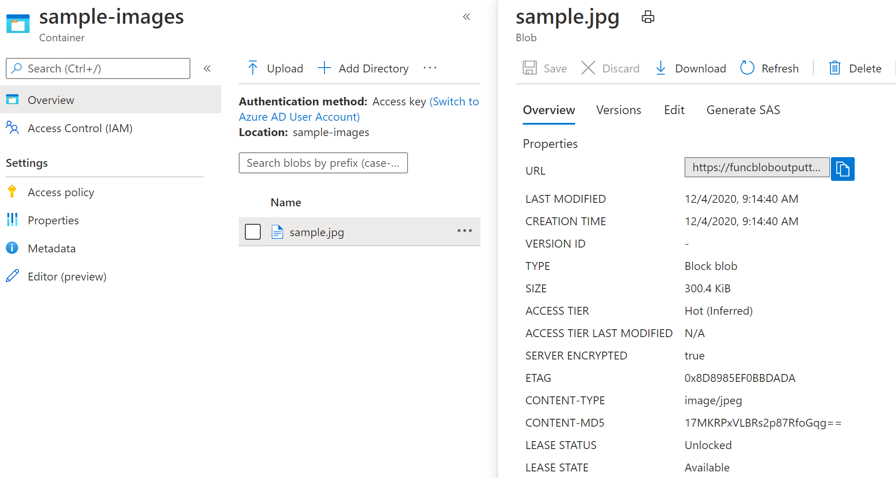
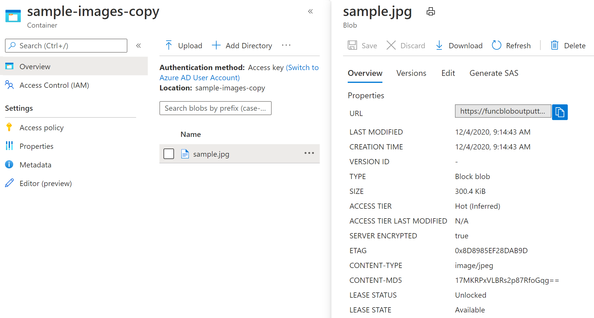

# azfuncblobwithcontenttype
An Azure Function that uses a BlobTrigger to copy a blob to another container while retaining the original blob content-type.

The Azure Functions Blob Output Binding, as of December 2020, [does not retain content-type property of blobs](https://github.com/Azure/azure-functions-host/issues/364).

This sample follows [the current guidance](https://github.com/Azure/azure-functions-eventhubs-extension/pull/18#discussion_r323513231) to use the [Blob libraries](https://docs.microsoft.com/en-us/azure/storage/blobs/storage-quickstart-blobs-dotnet) directly to set the content-type property.

Monitored container in the configured `input_container_name` from Blob Trigger with content-type:

Output blob in the configured `output_container_name` container with content-type:

